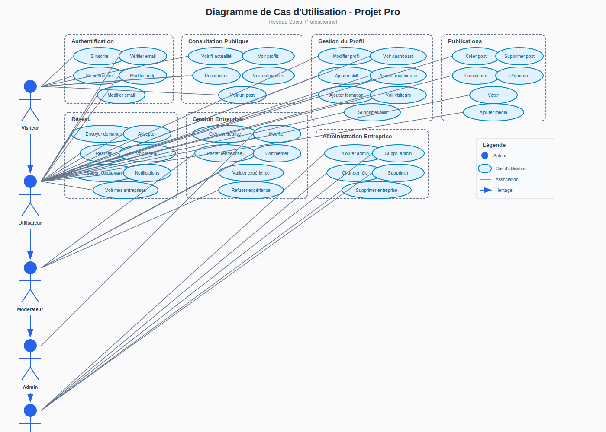
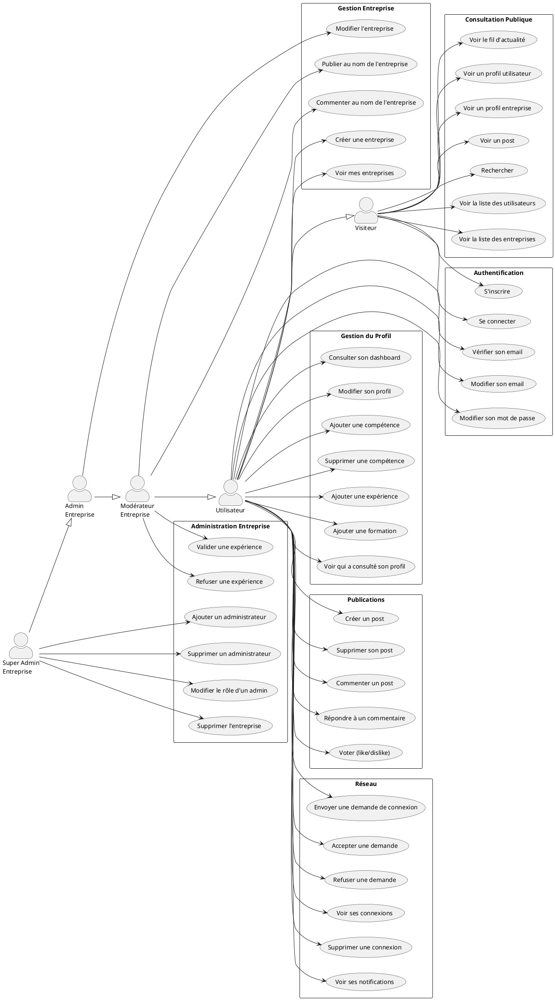

# Diagramme de Cas d'Utilisation - Projet Pro

## Diagramme



---

## Acteurs

| Acteur | Description |
|--------|-------------|
| **Visiteur** | Utilisateur non authentifié avec accès limité |
| **Utilisateur** | Utilisateur authentifié avec un compte vérifié |
| **Modérateur Entreprise** | Administrateur avec permissions limitées sur une entreprise |
| **Admin Entreprise** | Administrateur avec permissions élevées sur une entreprise |
| **Super Admin Entreprise** | Créateur de l'entreprise avec tous les droits |

---

## Diagramme de Cas d'Utilisation (Format PlantUML)



---

## Diagramme Simplifié (Format Mermaid)

```mermaid
flowchart TB
    subgraph Acteurs
        V[👤 Visiteur]
        U[👤 Utilisateur]
        M[👤 Modérateur]
        A[👤 Admin]
        SA[👤 Super Admin]
    end

    subgraph "🔐 Authentification"
        UC1[S'inscrire]
        UC2[Se connecter]
        UC3[Vérifier email]
        UC4[Modifier email/mdp]
    end

    subgraph "📋 Profil"
        UC5[Modifier profil]
        UC6[Gérer compétences]
        UC7[Gérer expériences]
        UC8[Gérer formations]
    end

    subgraph "👁️ Consultation"
        UC9[Voir fil d'actualité]
        UC10[Voir profils]
        UC11[Rechercher]
    end

    subgraph "📝 Publications"
        UC12[Créer post]
        UC13[Commenter]
        UC14[Voter]
    end

    subgraph "🤝 Réseau"
        UC15[Demandes de connexion]
        UC16[Gérer connexions]
        UC17[Notifications]
    end

    subgraph "🏢 Entreprise"
        UC18[Créer entreprise]
        UC19[Modifier entreprise]
        UC20[Publier comme entreprise]
    end

    subgraph "⚙️ Administration"
        UC21[Valider expériences]
        UC22[Gérer admins]
        UC23[Supprimer entreprise]
    end

    V --> UC1 & UC2 & UC9 & UC10 & UC11
    U --> UC3 & UC4 & UC5 & UC6 & UC7 & UC8
    U --> UC12 & UC13 & UC14 & UC15 & UC16 & UC17 & UC18
    M --> UC20 & UC21
    A --> UC19
    SA --> UC22 & UC23
```



---

## Détail des Cas d'Utilisation

### 1. Authentification

| ID | Cas d'utilisation | Acteur(s) | Description |
|----|-------------------|-----------|-------------|
| UC01 | S'inscrire | Visiteur | Créer un compte avec email et mot de passe |
| UC02 | Se connecter | Visiteur | Accéder à son compte existant |
| UC03 | Vérifier son email | Utilisateur | Confirmer son adresse email pour activer le compte |
| UC04 | Modifier son email | Utilisateur | Changer l'adresse email associée au compte |
| UC05 | Modifier son mot de passe | Utilisateur | Changer le mot de passe du compte |

### 2. Gestion du Profil

| ID | Cas d'utilisation | Acteur(s) | Description |
|----|-------------------|-----------|-------------|
| UC10 | Consulter son dashboard | Utilisateur | Voir son tableau de bord personnel |
| UC11 | Modifier son profil | Utilisateur | Éditer nom, prénom, photo, bio |
| UC12 | Ajouter une compétence | Utilisateur | Ajouter une skill avec niveau (1-5) |
| UC13 | Supprimer une compétence | Utilisateur | Retirer une compétence du profil |
| UC14 | Ajouter une expérience | Utilisateur | Déclarer une expérience professionnelle |
| UC15 | Ajouter une formation | Utilisateur | Ajouter un diplôme ou certification |
| UC16 | Voir qui a consulté son profil | Utilisateur | Consulter la liste des visiteurs |

### 3. Consultation Publique

| ID | Cas d'utilisation | Acteur(s) | Description |
|----|-------------------|-----------|-------------|
| UC20 | Voir le fil d'actualité | Tous | Consulter les derniers posts |
| UC21 | Voir un profil utilisateur | Tous | Consulter le profil d'un membre |
| UC22 | Voir un profil entreprise | Tous | Consulter la page d'une entreprise |
| UC23 | Voir un post | Tous | Afficher un post et ses commentaires |
| UC24 | Rechercher | Tous | Chercher des utilisateurs ou entreprises |
| UC25 | Voir la liste des utilisateurs | Tous | Parcourir tous les membres |
| UC26 | Voir la liste des entreprises | Tous | Parcourir toutes les entreprises |

### 4. Publications

| ID | Cas d'utilisation | Acteur(s) | Description |
|----|-------------------|-----------|-------------|
| UC30 | Créer un post | Utilisateur | Publier du contenu avec médias optionnels |
| UC31 | Supprimer son post | Utilisateur | Retirer une de ses publications |
| UC32 | Commenter un post | Utilisateur | Ajouter un commentaire sous un post |
| UC33 | Répondre à un commentaire | Utilisateur | Répondre à un commentaire existant |
| UC34 | Voter | Utilisateur | Like ou dislike sur post/commentaire |

### 5. Réseau

| ID | Cas d'utilisation | Acteur(s) | Description |
|----|-------------------|-----------|-------------|
| UC40 | Envoyer une demande de connexion | Utilisateur | Inviter un autre membre |
| UC41 | Accepter une demande | Utilisateur | Valider une invitation reçue |
| UC42 | Refuser une demande | Utilisateur | Décliner une invitation |
| UC43 | Voir ses connexions | Utilisateur | Afficher son réseau |
| UC44 | Supprimer une connexion | Utilisateur | Retirer un contact |
| UC45 | Voir ses notifications | Utilisateur | Consulter les alertes et demandes |

### 6. Gestion Entreprise

| ID | Cas d'utilisation | Acteur(s) | Description |
|----|-------------------|-----------|-------------|
| UC50 | Créer une entreprise | Utilisateur | Créer une page entreprise (devient Super Admin) |
| UC51 | Modifier l'entreprise | Admin, Super Admin | Éditer les infos de l'entreprise |
| UC52 | Publier au nom de l'entreprise | Modérateur+ | Créer un post comme l'entreprise |
| UC53 | Commenter au nom de l'entreprise | Modérateur+ | Commenter comme l'entreprise |
| UC54 | Voir mes entreprises | Utilisateur | Lister les entreprises administrées |

### 7. Administration Entreprise

| ID | Cas d'utilisation | Acteur(s) | Description |
|----|-------------------|-----------|-------------|
| UC60 | Valider une expérience | Modérateur+ | Confirmer l'expérience d'un employé |
| UC61 | Refuser une expérience | Modérateur+ | Rejeter une expérience déclarée |
| UC62 | Ajouter un administrateur | Super Admin | Nommer un nouveau admin/modérateur |
| UC63 | Supprimer un administrateur | Super Admin | Retirer un admin de l'entreprise |
| UC64 | Modifier le rôle d'un admin | Super Admin | Changer le niveau d'accès |
| UC65 | Supprimer l'entreprise | Super Admin | Supprimer définitivement l'entreprise |

---

## Matrice Acteurs / Cas d'Utilisation

| Cas d'utilisation | Visiteur | Utilisateur | Modérateur | Admin | Super Admin |
|-------------------|:--------:|:-----------:|:----------:|:-----:|:-----------:|
| S'inscrire | ✅ | - | - | - | - |
| Se connecter | ✅ | - | - | - | - |
| Voir fil d'actualité | ✅ | ✅ | ✅ | ✅ | ✅ |
| Voir profils | ✅ | ✅ | ✅ | ✅ | ✅ |
| Rechercher | ✅ | ✅ | ✅ | ✅ | ✅ |
| Modifier son profil | - | ✅ | ✅ | ✅ | ✅ |
| Gérer compétences | - | ✅ | ✅ | ✅ | ✅ |
| Créer un post | - | ✅ | ✅ | ✅ | ✅ |
| Commenter/Voter | - | ✅ | ✅ | ✅ | ✅ |
| Gérer son réseau | - | ✅ | ✅ | ✅ | ✅ |
| Créer entreprise | - | ✅ | ✅ | ✅ | ✅ |
| Publier comme entreprise | - | - | ✅ | ✅ | ✅ |
| Valider expériences | - | - | ✅ | ✅ | ✅ |
| Modifier entreprise | - | - | - | ✅ | ✅ |
| Gérer les admins | - | - | - | - | ✅ |
| Supprimer entreprise | - | - | - | - | ✅ |

---

## Flux Principaux

### Flux d'inscription et création de contenu

```
1. Visiteur → S'inscrire
2. Système → Envoyer email de vérification
3. Utilisateur → Vérifier son email
4. Système → Créer profil Writer
5. Utilisateur → Créer un post
```

### Flux de validation d'expérience

```
1. Utilisateur → Ajouter une expérience (entreprise X)
2. Système → Créer expérience (validated: false)
3. Admin Entreprise X → Voir expériences en attente
4. Admin → Valider/Refuser l'expérience
5. Système → Mettre à jour le statut
```

### Flux de connexion entre utilisateurs

```
1. Utilisateur A → Envoyer demande à B
2. Système → Créer relation (status: false)
3. Utilisateur B → Voir notification
4. Utilisateur B → Accepter/Refuser
5. Système → Mettre à jour relation
```

### Flux de création d'entreprise

```
1. Utilisateur → Créer entreprise
2. Système → Créer Company + CompanyAdmin (SUPER_ADMIN)
3. Système → Créer Writer pour l'entreprise
4. Système → Créer WriterLink (user → company writer)
5. Super Admin → Peut publier comme l'entreprise
```

---

## Notes Techniques

- **Authentification** : Utilise Better Auth
- **Base de données** : MySQL avec Prisma ORM
- **Recherche** : MeiliSearch pour la recherche full-text
- **Rôles entreprise** : Enum `CompanyRole` (SUPER_ADMIN, ADMIN, MODERATOR)
- **Système Writer** : Permet à un utilisateur de publier en son nom ou au nom d'une entreprise
